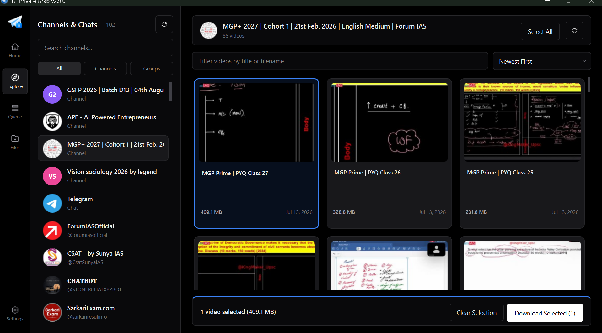
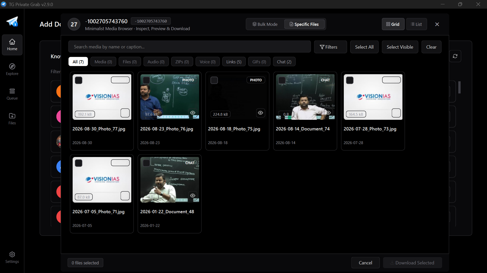
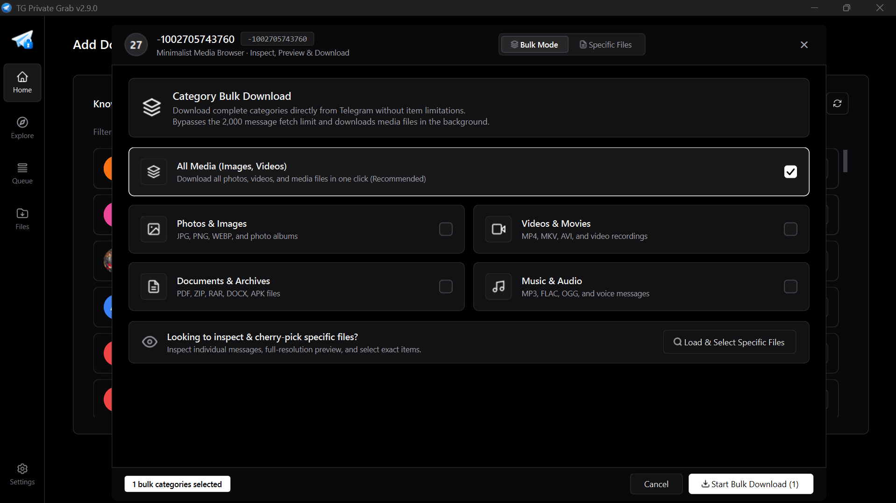
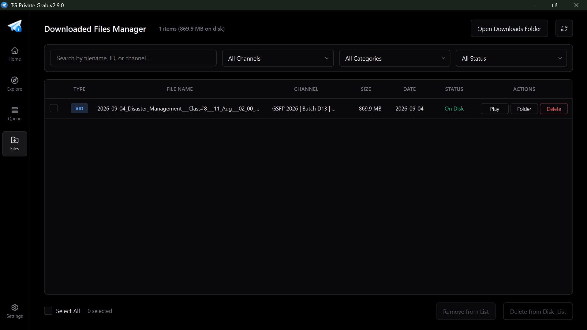
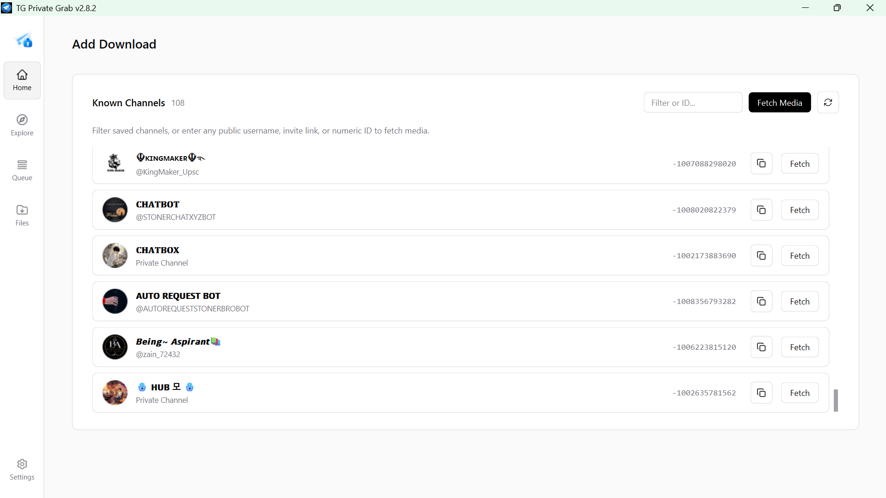

<p align="center">
  
</p>

<h1 align="center">TG Private Grab</h1>

<p align="center">
  <b>A sleek, high-performance Telegram media downloader with private channel support, instant media browsing, and multi-part turbo engine.</b>
</p>

<p align="center">
  <a href="https://github.com/DeepanshuK2002/Telegram_Private-Media_Grab/releases/latest">
    
  </a>
  <a href="https://github.com/DeepanshuK2002/Telegram_Private-Media_Grab/releases">
    
  </a>
  <a href="LICENSE">
    
  </a>
  
  
</p>

<p align="center">
  <a href="https://github.com/DeepanshuK2002/Telegram_Private-Media_Grab/releases/latest"><b>Download Latest Executable (Windows x64) →</b></a>
</p>

---

## 📸 Interface Showcase

<table align="center" width="100%">
  <tr>
    <td width="50%" align="center">
      <b>Explore Channels & Video Gallery (Dark Mode)</b><br/><br/>
      
    </td>
    <td width="50%" align="center">
      <b>Minimalist Media Browser (Grid View)</b><br/><br/>
      
    </td>
  </tr>
  <tr>
    <td width="50%" align="center">
      <b>Category Bulk Downloader</b><br/><br/>
      
    </td>
    <td width="50%" align="center">
      <b>Active Download Queue & Priority Tracking</b><br/><br/>
      
    </td>
  </tr>
  <tr>
    <td width="50%" align="center">
      <b>Downloaded Files Manager</b><br/><br/>
      
    </td>
    <td width="50%" align="center">
      <b>Home & Known Channels (Light Mode)</b><br/><br/>
      
    </td>
  </tr>
</table>

---

## ✨ Key Features

- ⚡ **FastTelethon Turbo Engine** — Parallel multi-chunk streaming (4 connections × 512 KB chunks) achieving up to **10x–20x faster** download throughput.
- 🔓 **Private & Restricted Channel Support** — Download media from private chats, restricted channels, groups, and forums without restrictions.
- 🗄️ **SQLite Persistence Engine** — Reliable, crash-proof active queue tracking with byte-range resume via explicit offsets.
- 🖼️ **Instant Media Browser** — Zero-wait cached gallery with grid/list view toggle, full-resolution thumbnails, and instant file searching.
- 📁 **Dedicated Files Manager** — Search, filter by channel/media type, reveal in Explorer, or bulk-delete completed downloads directly from the app.
- 📦 **Single-File Portable Windows Build** — Download and run immediately with no Python runtime or external dependencies required.
- 🔄 **Silent Auto-Update** — Built-in background update checker that downloads and installs releases seamlessly.
- 📅 **Chronological Naming** — Automatically prefix filenames with publication timestamps (`YYYY-MM-DD_title.ext`).
- 🌓 **Adaptive Light & Dark Themes** — Telegram-inspired dark and light colorways with persistent preferences.
- 🔐 **Zero-Knowledge Privacy** — Credentials and session data stay 100% local on your machine.

---

## 🚀 Quick Start

### Option A: Portable Windows Executable (Recommended)

1. Head to the [Latest Releases](https://github.com/DeepanshuK2002/Telegram_Private-Media_Grab/releases/latest).
2. Download **`TGPrivateGrab-v2.9.0.exe`**.
3. Double-click to launch — no installation required.

> **Note**: Windows SmartScreen may display a prompt on first launch because the binary is freshly built. Click **More info → Run anyway**.

---

### Option B: Run from Source

```bash
# 1. Clone the repository
git clone https://github.com/DeepanshuK2002/Telegram_Private-Media_Grab.git
cd Telegram_Private-Media_Grab

# 2. Create and activate a virtual environment
python -m venv venv
# Windows:
venv\Scripts\activate
# Linux / macOS:
source venv/bin/activate

# 3. Install dependencies
pip install -r requirements.txt

# 4. Launch the application
python src/gui.py
```

---

## ⚙️ Configuration

On first run, you can provide your credentials directly in the login screen, or create a `.env` file in the project root:

```env
API_ID=12345678
API_HASH=0123456789abcdef0123456789abcdef
PHONE=+1234567890
```

> **Where do I get my API ID and Hash?**
> Log in to [my.telegram.org](https://my.telegram.org), go to **API Development Tools**, and generate your free Telegram API keys.

---

## 🛠️ Architecture & Tech Stack

| Component | Technology | Purpose |
| :--- | :--- | :--- |
| **GUI Framework** | [PySide6 (Qt 6)](https://wiki.qt.io/Qt_for_Python) | Responsive desktop interface with hardware-accelerated rendering |
| **Telegram Core** | [Telethon](https://github.com/LonamiWebs/Telethon) | Async MTProto protocol client for Telegram communications |
| **Download Accelerator** | `FastTelethon` | Multi-connection chunk streaming with cryptg crypto-acceleration |
| **Database** | SQLite3 (WAL mode) | Local persistence for queued downloads, cached channels, and file history |
| **Packaging** | PyInstaller / Nuitka | Standalone single-file binary with bytecode optimization |

---

## 🤝 Contributing

Contributions, bug reports, and suggestions are welcome! Feel free to open an issue or submit a pull request. Please see [CONTRIBUTING.md](CONTRIBUTING.md) for contribution guidelines.

---

## 📄 License

This project is open-source and licensed under the [MIT License](LICENSE).

<p align="center">
  Developed & Maintained by <a href="https://github.com/DeepanshuK2002"><b>Deepanshu Kashyap</b></a>
</p>
