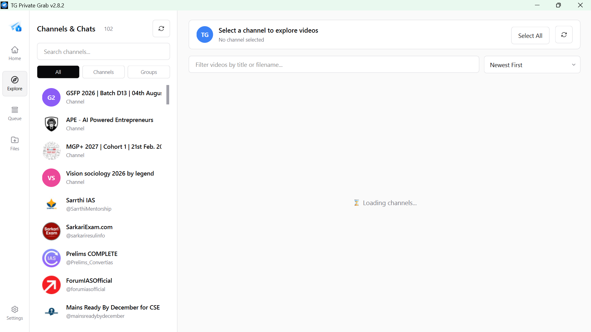
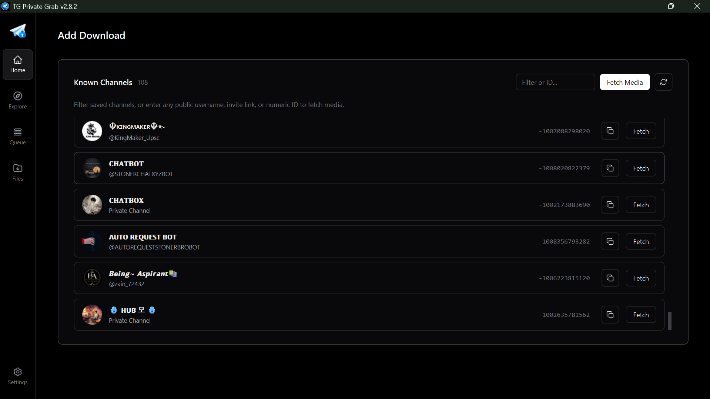
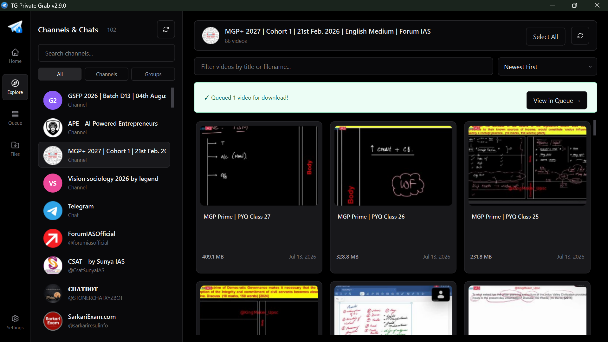
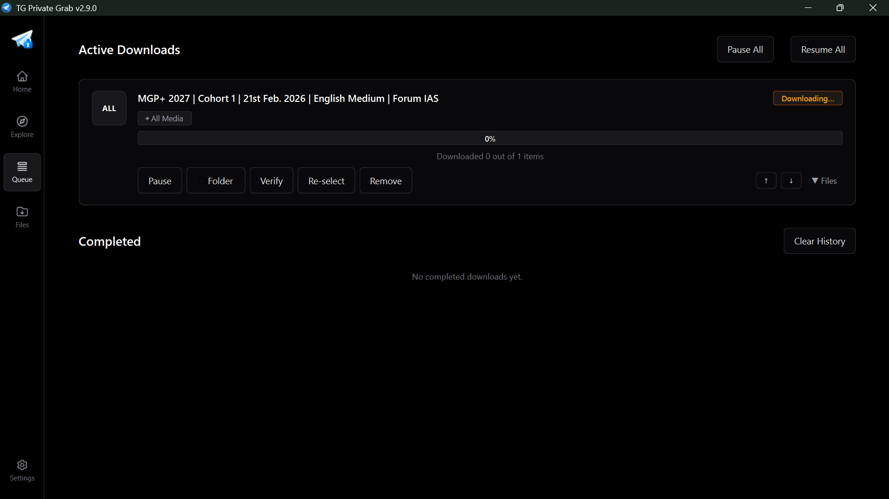
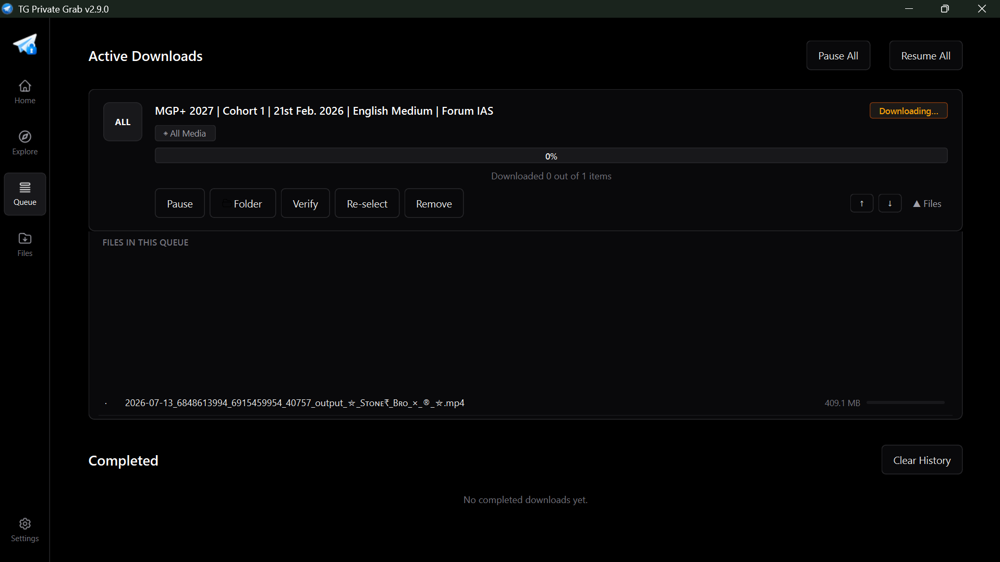
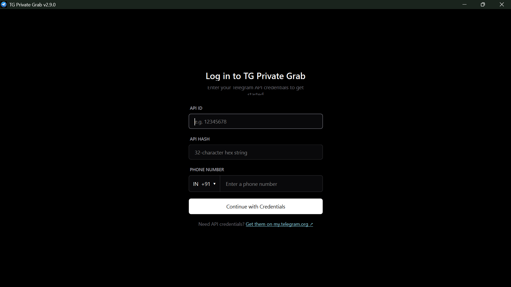

<p align="center">
  
</p>

<h1 align="center">TG Private Grab</h1>

<p align="center">
  <b>🚀 High-performance bulk downloader for Telegram private & restricted channels, groups, and chats. Built with a modern PySide6 desktop GUI, FastTelethon multi-part turbo engine, instant media gallery, SQLite queue persistence, file manager, byte-range resume, auto-updater, and adaptive dark/light themes.</b>
</p>

<p align="center">
  <a href="https://github.com/DeepanshuK2002/Telegram_Private-Media_Grab/releases/latest">
    
  </a>
  <a href="https://github.com/DeepanshuK2002/Telegram_Private-Media_Grab/releases">
    
  </a>
  <a href="LICENSE">
    
  </a>
  
  
  
</p>

<p align="center">
  <a href="https://github.com/DeepanshuK2002/Telegram_Private-Media_Grab/releases/latest">
    <b>⚡ Download Latest Standalone Executable (Windows x64) →</b>
  </a>
</p>

---

## 📖 About TG Private Grab

**TG Private Grab** is a dedicated, Windows-first Telegram media extraction and download workstation designed to overcome standard client limitations. Whether fetching gigabytes of videos from private discussion groups, archiving document libraries, or grabbing photos from restricted channels where saving is disabled, TG Private Grab provides unmatched speed, complete queue persistence, and a native desktop interface.

### Topics & Tags
`telegram` • `telegram-downloader` • `telegram-media-downloader` • `telegram-private-downloader` • `private-channel-downloader` • `telegram-grabber` • `telethon` • `fast-telethon` • `pyside6` • `qt6` • `python` • `media-downloader` • `video-downloader` • `bulk-downloader` • `file-manager` • `desktop-app` • `windows-app` • `dark-mode` • `sqlite3` • `auto-update`

---

## 📸 Interface Showcase

All screenshots are captured directly from the live application, illustrating both the Dark and Light modes.

### 1. Explore Channels & Video Gallery `[Dark Mode]`
Browse all joined channels, forums, and chats with cached profile avatars and thumbnail previews. Filter videos in real time with multi-select capabilities.

<p align="center">
  
</p>

---

### 2. Explore Channels & Video Gallery `[Light Mode]`
The same intuitive explore interface rendered in clean Telegram-style Light Mode.

<p align="center">
  
</p>

---

### 3. Home Dashboard & Known Channels `[Dark Mode]`
Quick-access hub listing all previously accessed channels with one-click media fetching and clipboard ID copying.

<p align="center">
  
</p>

---

### 4. Home Dashboard & Known Channels `[Light Mode]`
Light theme presentation of the Home dashboard, optimized for bright environments.

<p align="center">
  
</p>

---

### 5. Minimalist Media Browser — Grid View `[Dark Mode]`
Inspect, preview, and cherry-pick specific files with instant thumbnail caching, file sizes, publication dates, and category filtering (Media, Files, Audio, ZIPs, Voice, Links, GIFs).

<p align="center">
  
</p>

---

### 6. Category Bulk Download Selector `[Dark Mode]`
Bypass Telegram's message fetch limits and queue entire categories (Photos, Videos, Documents, Music) in a single click.

<p align="center">
  
</p>

---

### 7. Instant Queue Feedback Toast `[Dark Mode]`
Non-intrusive in-app banner confirming queued items with a direct shortcut to the active queue.

<p align="center">
  
</p>

---

### 8. Active Download Queue & Priority Tracking `[Dark Mode]`
Monitor aggregate session progress %, real-time speeds with EMA smoothing, pause/resume controls, and task prioritization.

<p align="center">
  
</p>

---

### 9. Active Download Queue — Expanded File Tracking `[Dark Mode]`
Expand any queue card to inspect live download progress for individual files, chunk completion, and error states.

<p align="center">
  
</p>

---

### 10. Downloaded Files Manager `[Dark Mode]`
Full-featured file manager to search, filter by channel or media category, play media, open containing folders, or bulk-delete items from disk.

<p align="center">
  
</p>

---

### 11. Modern Authentication & API Credentials `[Dark Mode]`
Vercel-inspired login form with international phone prefix selector and secure local credential storage.

<p align="center">
  
</p>

---

## ✨ Core Capabilities

- ⚡ **FastTelethon Turbo Engine** — Parallel multi-part streaming (4 worker connections × 512 KB chunks) for media > 1 MB, delivering **10x–20x faster** speeds.
- 🔓 **Private & Restricted Channel Grabbing** — Seamlessly download media from private groups, forums, and restricted channels where downloading or forwarding is normally blocked.
- 🗄️ **SQLite Persistence Engine** — All active tasks, channel states, and history are backed by an indexed SQLite database in WAL mode with byte-range resume via explicit offsets.
- 🖼️ **Instant Media Gallery** — Zero-wait browsing using local disk thumbnail caching while the background thread synchronizes new messages.
- 📁 **Dedicated Files Manager** — Comprehensive file viewer with search, multi-select bulk operations, and physical disk synchronization.
- 📦 **Single-File Portable Windows Executable** — Self-contained binary with no Python installation or setup required.
- 🔄 **Silent In-App Auto-Update** — Detects new GitHub releases, downloads update packages in the background, and seamlessly applies them.
- 📅 **Chronological Naming** — Automatically prefix downloaded files with original publication dates (`YYYY-MM-DD_filename.ext`).
- 🌓 **Theme Support** — Fully integrated Light and Dark palettes designed for long-session comfort.
- 🔐 **Privacy-First Architecture** — API credentials, session tokens, and download databases are kept 100% on your local machine.

---

## 🚀 Quick Start

### Method 1: Portable Executable (Recommended)

1. Navigate to [Releases](https://github.com/DeepanshuK2002/Telegram_Private-Media_Grab/releases/latest).
2. Download **`TGPrivateGrab-v2.9.0.exe`**.
3. Double-click to launch — completely standalone.

> **Windows Note**: If Windows SmartScreen displays a warning for the unsigned binary, click **More info → Run anyway**.

---

### Method 2: Run from Source

```bash
# 1. Clone the repository
git clone https://github.com/DeepanshuK2002/Telegram_Private-Media_Grab.git
cd Telegram_Private-Media_Grab

# 2. Set up virtual environment
python -m venv venv
# Windows:
venv\Scripts\activate
# Linux / macOS:
source venv/bin/activate

# 3. Install requirements
pip install -r requirements.txt

# 4. Run the application
python src/gui.py
```

---

## ⚙️ Credentials & Setup

Enter your credentials directly in the application's login screen on first run, or configure a `.env` file in the root folder:

```env
API_ID=12345678
API_HASH=0123456789abcdef0123456789abcdef
PHONE=+1234567890
```

> **How to obtain credentials:**
> Visit [my.telegram.org](https://my.telegram.org), sign in with your phone number, select **API Development Tools**, and create an app to obtain your `API_ID` and `API_HASH`.

---

## 🛠️ Tech Stack

| Module | Technology | Role |
| :--- | :--- | :--- |
| **Desktop Framework** | [PySide6 (Qt 6)](https://wiki.qt.io/Qt_for_Python) | Modern desktop UI, vector styling, and DPI-aware layouts |
| **Telegram Protocol** | [Telethon](https://github.com/LonamiWebs/Telethon) | Asynchronous MTProto Telegram client implementation |
| **Speed Accelerator** | `FastTelethon` + `cryptg` | Multi-connection chunk streaming with native AES acceleration |
| **Database** | SQLite3 (WAL mode) | Resilient persistence for tasks, channels, and download records |
| **Binary Packaging** | PyInstaller & Nuitka | Standalone Windows executable with bytecode optimization |

---

## 🤝 Contributing

Contributions and feedback are welcome! Please review [CONTRIBUTING.md](CONTRIBUTING.md) for pull request guidelines, coding standards, and project architecture details.

---

## 📄 License

Distributed under the **MIT License**. See [LICENSE](LICENSE) for details.

<p align="center">
  Developed & Maintained with ❤️ by <a href="https://github.com/DeepanshuK2002"><b>Deepanshu Kashyap</b></a>
</p>
